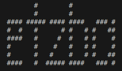

<div style="text-align:center"></div>


- [Installing](#installing)
	- [Linux installation](#linux-installation)
  - [OSX Installation](#osx-installation)
- [Getting started](#getting-started)
  - [Runnig etz](#running-etz)
  - [Use simple execution file](#use-simple-execution-file)
- [Configuring test cases](#configuring-test-cases)
	- [General Config](#general-config)
    - [Executions](#executions)
        - [Api](#api)
        - [Sql](#sql)
        - [File](#file)
- [Usage](#usage)
	- [Run etz with general config](#run-etz-with-general-config)
    - [Run etz with executions file](#run-etz-with-executions-file)
    - [Cli args](#cli-args)
    - [Examples](#examples)
- [Advanced configurations](#advanced-configurations)
    - [Use authentication file](#use-authentication-file)
    - [Using go template](#using-go-template)

### Installing

To download and install `etz`:  

#### Linux installation

To download and install `etz` for linux:

``` sh
wget https://raw.githubusercontent.com/etzba/etz/master/etzba_linux_amd64_v1/etz
sudo mv etz /usr/bin/
etz --version
```

#### OSX Installation

To download and install `etz` on OSX:

``` sh
wget https://raw.githubusercontent.com/etzba/etz/master/etzba_darwin_amd64_v1/etz
sudo mv etz /usr/local/bin/
etz --version
```

### Getting started

In this section we are going to start running `etz` in the simplest way

#### Running etz

`etz` uses several sub commands: `api`, `pg` and `file`. To use `etz` without additional load test configuration for `api` (change `--url` to your http service): 

```sh
$ etz api --url=http://localhost:8080/ --method=GET
```

Additional command line args available to `api`. cli args documented here: [Cli args](#cli-args):
```sh
$ etz api --url=http://localhost:8080/ --method=POST -j '{ "name": "Etz", "address": "Ba etzba etz 32" }' -d 3s -w 3 -r 9

$ etz api --url=http://localhost:8080/ --method=GET --output=files/result.json
```

or using `etz` to test file upload to an http server (change `--path` to your files dir and `--url` to your http service):
```sh
$ etz file --url=http://localhost:8080/ --method=POST --path=relative/path/to/files/
```

#### Use simple execution file

`etz` can use execution or config file to build extended test cases. An example of a simple yaml execution file:

``` yaml
api:
- url: http://localhost:8080/
  method: POST
  payload:
    prop1: "etz"
    prop2: "etzba etz"
``` 

And how to run it:

``` sh
etz api --exec=path/to/executions.yaml
```

### Configuring test cases

To run `etz` a configuration or executions file is needed

#### General config

``` yaml
settings:
  config:
    workers: 10                 # number of workers during execution
    rps: 200                    # request per second during execution
    duration: 3s                # execution duration
    output: /tmp/results.json   # results output file
    verbose: true               # debug workers during execution    

executions:
  locations:                    # scenario name
    api:
    - url: http://localhost:8080/locations
      method: GET
    - url: http://localhost:8080/locations/2
      method: GET
  posts:                        # scenario name
    file:
    - url: http://localhost:8080/posts
      method: POST
      directory: myfiles/
```

#### Executions

`etz` has the ability to execute a specific tests for `api`, `sql` and upload a `file` to api server. This section will show how to create executions configuration for each kind. 

##### api

To prepare test against an http service, create `executions.yaml` file on your local machine, similar to the file below:

``` yaml
api:
- url: https://etzba.com/v1/some/endpoint
  method: GET
- url: https://etzba.com/v1/some/endpoint
  method: POST
```

##### sql

`pg` command will test the performance of postgresql instance by creating an execution file for sql:

``` yaml
sql:                            # sql specifications
- command: SELECT
  table: locations
  constraint: "longtitude BETWEEN 13.0 AND 15.0"
- command: UPDATE
  table: locations
  constraint: "longtitude BETWEEN 13.0 AND 15.0 AND latitude BETWEEN 13.0 AND 15.0"
  values: 
    latitude: 14.232134112
- command: INSERT
  table: locations
  values: 
    name: "someplace"
    address: "better_street_32" 
    longtitude: 89.123123123
    latitude: -98.1234123123
```

##### file

`file` execution will test the performance of file upload to an api server. A `file` execution yaml example:

``` yaml
file:                             # file upload specifications
- url: http://localhost:8080/posts
  method: POST
  directory: path/to/posts/       # files directory (relative to etz binary location)
- url: http://localhost:8080/pics
  method: PUT
  directory: path/to/images/
```

### Usage

After installing `etz` locally and create a config or execution file, you can run tests from terminal with general config or execution file.

#### Run etz with general config

To run a test with general config:

```sh
etz --config=path/to/config.yaml
```

#### Run etz with executions file

`etz` can run dedicated test with additional commands - `api`, `pg` and `file` together with an execution file with command args `--exec` as follows: 

```sh
etz api --exec=path/to/exec/file.yaml
```

`api` command run test against http service:

```sh
etz api --auth=examples/api/gopu/secret.yaml --exec=examples/api/gopu/executions.yaml -d=8s -w=6 -r=24 --output=files/$(date +%Y%m%d_%H%M%S)_result.json
```

`pg` will be testing straight by connecting directly to postgres instance (`--auth` to mention auth file is needed):

```sh
etz pg --workers=3 --auth=examples/pgsql/secret.json --exec=examples/pgsql/executions.yaml --duration=3s
```

`file` will upload a file to an http endpoint:

```sh
etz file --url=http://localhost:8080/docs --method=PUT --path=assets/ -w=6 -r=6 -v
```

#### Cli args

| Arg        | Type     | Description  |
| ---------- | -------- | ------------ |
| `workers`  | int      | How many go routines to run during the test. For exmaple: `--workers 12` |
| `rps`      | int      | Define request per second while running api test. For exmaple: `-r 20`   |
| `duration` | str      | Using `-d` define for how long the test should run. For example: `-d 30s` will run the test for 30 seconds. s/m/h are the available time units |
| `auth`     | str      | To use additional authentication file. |
| `exec`     | str      | While using executions file. |
| `config`   | str      | While using general config file. |
| `url`      | str      | Specify api service URL for the test, instead of specifying url in the file. Available in `api` and `file` commands |
| `method`   | str      | While testing http service with `api` or `file` commands, use method like: `--method=POST` |
| `payload`  | str      | Add data in JSON string to an http requests. Available in `api` command and should be used in this way: `-j='{ "name": "Etz", "address": "Ba etzba etz 32" }'` |
| `path`     | str      | Set files directory when using `file` command |
| `output`   | str      | Generate a test results file in json. For example: `--output=~/results/20250123_result.json` |
| `verbose`  | bool     | To show logs from workers while running the test. |

#### Examples

These are few extended usage examples to run `etz` from cli: 

``` sh
etz --config=examples/pgsql/config.yaml

etz api --auth=examples/api/gopu/secret.yaml --exec=examples/api/gopu/executions.yaml -d=8s -w=6 -r=24 --output=files/$(date +%Y%m%d_%H%M%S)_result.json

etz pg --workers=3 --auth=examples/pgsql/secret.json --exec=examples/pgsql/executions.yaml --duration=3s

etz file --url=http://localhost:8080/docs --method=PUT --path=assets/ -w=6 -r=6 -v

etz file --exec=examples/api/gopu/fileup.yaml -d=3s -w=1 -r=1

etz api --exec=examples/api/gopu/executions.yaml -d=8s -w=4 -r=12 --output=files/$(date +%Y%m%d_%H%M%S)_result.json
```

### Advanced configurations

#### Use authentication file

Using `--auth` will allow to authenticate to an http service or sql instance.

Example of postgres auth file:
```yaml
sql:
  host: localhost
  port: 5432
  database: etzba
  user: etzba
  password: Pass1234
```

An example for http service auth file:
```yaml
apiAuth:
  method: Bearer
  token: XVlBzgbaiCMRAjWwhTHctcuAxhxKQFDa
```

#### Using go template

Creating variables and using functions inside yaml file is possible as well. For example:

``` yaml
{{ $baseUrl := printf "%s" "http://localhost:8080" }}
{{ $dir := printf "%s" "assets/" }}
{{ $slice := makeIntSlice 1 2 3 4 }}

settings:
  config:
    workers: 10   # number of workers during execution
    rps: 2    # request per second during execution
    duration: 3s   # execution duration
    output: /tmp/results.json   # results output file
    verbose: true   # debug workers during execution    

executions:
  locations:    # scenario name
    api:
    {{ range $slice }}
    - url: {{ $baseUrl }}/locations/{{ . }}
      method: GET
    {{ end }}
  files:
    file:
    - url: {{ $baseUrl }}/posts
      method: POST
      directory: {{ $dir }}
    - url: {{ $baseUrl }}/pics
      method: PUT
      directory: {{ $dir }}
```
For more details: [go template](https://pkg.go.dev/text/template)

##### Built-in yaml golang templates functions

To create versatile load tests, some golang template functions available to use inside the yaml file. For example, a load test could be planned as follow:

```yaml
{{ $baseUrl := printf "%s" "http://localhost:8080" }}
{{ $slice := makeIntSlice 1 2 3 4 }}
{{ $sumSlice := makeIntSliceBySum 100 }}

settings:
  apiAuth:
    method: Bearer
    token: XVlBzgbaiCMRAjWwhTHctcuAxhxKQFDa

executions:
  easy:                                           # scenario name
    config:                                       # scenario configuration
      workers: 5
      rps: 20
      duration: 30m
      output: files/easy.json 
    api:                                          # execution type for scenario
    {{ range $sumSlice }}
    - url: {{ $baseUrl }}/location
      method: POST
      data: 
        name: {{ getRandStringInLength 5 }}
        address: {{ getRandStringInLength 23 }}
        longtitude: {{ getFloatInRange 21 90 }}
        latitude: {{ getFloatInRange -80 10 }}
    {{ end }}
    {{ range $slice }}
    - url: {{ $baseUrl }}/locations/{{ getIntInRange 250 1 }}
      method: DELETE
    {{ end }}
  medium:                                          # scenario name
    config:
      workers: 15
      rps: 60
      duration: 3s
      output: files/medium.json 
    api:
    {{ range $sumSlice }}
    {{ $num := getIntInRange 250 1 }}
    - url: {{ printf "%s/locations/%d" $baseUrl $num }}
      method: PUT
      data: 
        name: {{ getRandStringInLength 5 }}
        address: {{ getRandStringInLength 23 }}
        longtitude: {{ getFloatInRange 21 90 }}
        latitude: {{ getFloatInRange -80 10 }}
    {{ end }}
  hard:                                             # scenario name
    config:
      workers: 30
      rps: 120
      duration: 3s
      output: files/hard.json 
    api:
    {{ range $sumSlice }}
    - url: {{ $baseUrl }}/location
      method: POST
      data: 
        name: {{ getRandStringInLength 5 }}
        address: {{ getRandStringInLength 23 }}
        longtitude: {{ getFloatInRange 21 90 }}
        latitude: {{ getFloatInRange -80 10 }}
    {{ end }}
    {{ range $sumSlice }}
    - url: {{ $baseUrl }}/locations/{{ getIntInRange 250 1 }}
      method: GET
    {{ end }}
```
Available golang functions to add to your yaml file:

| Function                 | Syntax                                  | Description                |
| ------------------------ | --------------------------------------- | -------------------------- |
| `makeAnySlice`           | `{{ $slice := makeAnySlice }}`          |
| `makeIntSlice`           | `{{ $slice := makeIntSlice 1 2 3 4 }}`  | To make a slice of integers
| `makeIntSliceBySum`      | `{{ $slice := makeIntSliceBySum 250 }}` | Generate a slice from 0 - 249
| `getUuid`                | `{{ $id := getUuid }}`                  | Generate a uuid string
| `getIntInRange`          | `{{ $num := getIntInRange 20 5 }}`      | Get randon integer in range between maximum to minimum (func max min)
| `getFloatInRange`        | `{{ $num := getFloatInRange 2 0 }}`     | Get a random float in range (func max min)
| `getRandStringInLength`  | `{{ $str := getRandStringInLength 20 }}`| Get a random string in length of an integer (func int) 

<!-- HaDewq43rTqeesd34SDFXCVwq67845SDF== -->